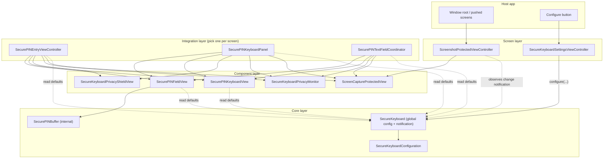
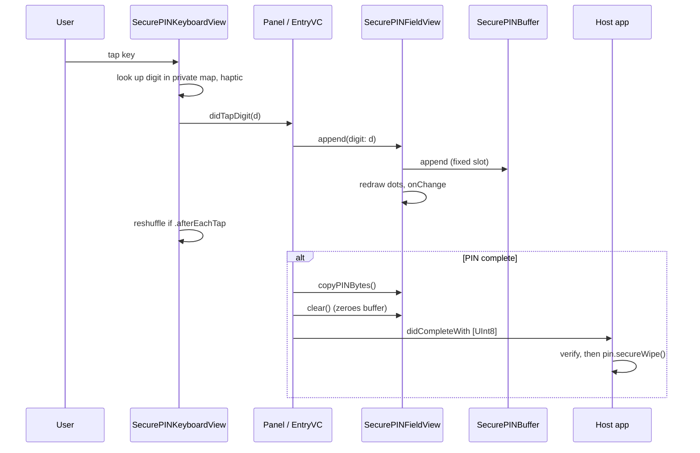

# SecurePINKeyboard: Architecture Report

| | |
| --- | --- |
| Package | `SecurePINKeyboard` (Swift Package Manager, one library product) |
| Platform | iOS 14.0+, UIKit |
| Toolchain | swift-tools-version 5.9, Swift 5 language mode; built with Xcode 26.0.1 / Swift 6.2 |
| Demo app | `SecuredKeyboard/SecuredKeyboard.xcodeproj` (iOS 15+), uses the package as a local dependency |
| Date | 2026-10-01 |

---

## 1. Purpose

SecurePINKeyboard lets an iOS app collect a numeric PIN without the
usual leak paths:

- third-party or system keyboards
- `String` copies left in memory
- predictable key positions
- screenshots, screen recordings and mirroring
- app-switcher snapshots
- input left on screen when the user walks away or the device locks

All of this sits behind a small API that can be configured with one call,
and it ships as a Swift package so another project can add it in a few
clicks.

---

## 2. Repository layout

```
keyboard/                                   ← package root (git repo root)
├── Package.swift                           ← SPM manifest
├── README.md                               ← integration guide
├── report.md                               ← this document
├── Sources/SecurePINKeyboard/              ← the library (single source of truth)
│   ├── SecureKeyboard.swift                    entry point + global configuration
│   ├── SecureKeyboardConfiguration.swift       all settings, enums, texts
│   ├── ScreenshotProtectedViewController.swift whole-screen screenshot blocking
│   ├── ScreenCaptureProtectedView.swift        secure-canvas host view
│   ├── SecureKeyboardSettingsViewController.swift ready-made settings page
│   ├── SecurePINEntryViewController.swift      full-screen PIN entry
│   ├── SecurePINKeyboardPanel.swift            slide-up keypad for an inline field
│   ├── SecurePINTextFieldCoordinator.swift     keypad for existing UITextFields
│   ├── SecurePINFieldView.swift                masked PIN display
│   ├── SecurePINKeyboardView.swift             the keypad
│   ├── SecurePINBuffer.swift                   zeroing digit storage (internal)
│   ├── SecureKeyboardPrivacyMonitor.swift      system privacy events
│   └── SecureKeyboardPrivacyShieldView.swift   cover shown while input is hidden
└── SecuredKeyboard/                        ← demo app
    ├── SecuredKeyboard.xcodeproj               links the local package (relativePath "..")
    └── SecuredKeyboard/
        ├── SceneDelegate.swift                 configure() + ScreenshotProtectedViewController root
        ├── ViewController.swift                home: Configure button + demo list
        └── Demo/                               one screen per integration style
```

The keyboard sources used to be compiled directly into the app target from
`SecuredKeyboard/SecuredKeyboard/keyboard/`. An older 1.x copy with a
different API also sat under `Sources/`. Both have been merged into a single
`Sources/SecurePINKeyboard/`. The app now links the package, so the demo
always exercises exactly the code that other projects get.

---

## 3. Layered architecture



| Layer | Responsibility | Depends on |
| --- | --- | --- |
| **Core** | Settings values, global default, PIN bytes | Foundation / UIKit types only |
| **Component** | Single-purpose views and observers | Core |
| **Integration** | Complete PIN-entry flows wired to privacy events | Components |
| **Screen** | App-level concerns: screenshot blocking and settings UI | Core + `ScreenCaptureProtectedView` |

Dependencies only point downward. No component knows which integration it
is used by. Each integration takes an optional `SecureKeyboardConfiguration`;
when that is `nil`, it falls back to `SecureKeyboard.configuration`.

---

## 4. Core layer

### 4.1 `SecureKeyboardConfiguration`

A value type (`struct`) that holds every tunable setting, grouped as follows:

| Group | Settings |
| --- | --- |
| Behaviour | `pinLength` (clamped 1…12), `entryMode`, `shuffleMode`, `hapticFeedback`, `accessoryKey` |
| Security | `protectsAgainstScreenCapture`, **`preventsScreenshots`** (new), `clearsOnScreenshot`, `clearsWhenAppResignsActive` |
| Theme | `accentColor`, `errorColor`, `successColor` |
| Keypad | height, colours, font, corner radius, border, spacing, insets, backspace image |
| PIN field | `fieldStyle` (single box / separate boxes), sizes, colours, icon, dot size, title font |
| Texts | `SecureKeyboardTexts`: every user-facing string, for localisation |

Because it is a value type, a screen can take a customised copy without
changing anyone else's settings.

### 4.2 `SecureKeyboard` (entry point)

`SecureKeyboard` is a `@MainActor` enum namespace with these members:

- `configuration`: the app-wide default. It can only be set through the API.
- `configure(applyGlobally:…)`: every parameter is optional, and `nil` keeps
  the current value. With `applyGlobally: false`, it returns a modified copy
  for one screen and leaves the default alone.
- `resetConfiguration()`
- **`configurationDidChangeNotification`** (new): posted from the
  `configuration` setter's `didSet`. Long-lived objects such as
  `ScreenshotProtectedViewController` and the settings page observe it, so
  changes apply live.

### 4.3 `SecurePINBuffer` (internal)

- A fixed-capacity `[UInt8]` sized when created, so it never reallocates and
  never leaves stale copies behind.
- `removeLast()` zeroes the slot it removes. `removeAll()` and `deinit`
  zero the whole storage with `memset`.
- `constantTimeEquals` XORs every byte across the full capacity, without an
  early exit, so timing doesn't reveal where two PINs differ.
- The buffer is not actor-isolated on purpose. Its `deinit` must be able to
  wipe memory whatever the host's default isolation is.
- PINs leave the module only through `copyPINBytes()` as `[UInt8]`. The
  public `Array<UInt8>.secureWipe()` lets callers zero their copy.

---

## 5. Component layer

### 5.1 `SecurePINKeyboardView`: the keypad

- A 4×3 grid: nine digit keys, then the accessory key, `0`, and backspace.
- **Mapping is private.** Each key's digit lives in a private
  `[ObjectIdentifier: Int]` map, not in `UIButton.tag`, so the layout can't
  be read from the view hierarchy.
- **Shuffling** uses `SystemRandomNumberGenerator`, which is
  cryptographically secure:
  - `.never`: fixed order
  - `.onAppear`: reshuffled when the keypad joins a window and after a clear
  - `.afterEachTap`: reshuffled after every key press
- **Accessibility leaks closed:** `accessibilityElementsHidden`, and keys
  are not accessibility elements, so VoiceOver and automation tools can't
  read the layout.
- **Touch safety:** `isExclusiveTouch` and multi-touch disabled.
- **Sizing:** `keyboardHeight` applies above the bottom safe area, so the
  host only has to pin the edges.

### 5.2 `SecurePINFieldView`: the masked display

The field works in two modes:

- **Buffered:** the field owns a `SecurePINBuffer` and is driven through
  `append`, `deleteBackward`, `clear` and `copyPINBytes`. The panel and the
  entry controller use this mode.
- **Display-only:** the field only mirrors a count through
  `setFilledCount`. The text-field coordinator uses this mode, because the
  `UITextField` owns the text there.

It also provides:

- two styles, `singleBox` and `separateBoxes`
- `showError(shake:)`
- an active-border highlight
- dark-mode-safe `CGColor` refresh
- an accessibility value of "n of m digits entered", with no digits exposed

### 5.3 `ScreenCaptureProtectedView`: the protection primitive

- It hosts a `UITextField` with `isSecureTextEntry = true` and finds that
  field's internal canvas subview.
- It moves `contentView` inside that canvas. iOS leaves secure text-entry
  layers out of screenshots, screen recordings and AirPlay / mirroring, so
  everything in `contentView` is captured blank.
- `hitTest` is overridden to route touches straight into `contentView`. The
  text field itself has interaction disabled.
- **Fail-open:** if the canvas can't be found on a future iOS, content is
  added normally, so it's still visible but unprotected, and `isProtected`
  is `false`. The alternative, a blank screen in production, is worse.
- **Changes in this release:**
  - The text field's content hugging and compression resistance are lowered
    to `.fittingSizeLevel`, so the hosted content always sets the size, never
    the text field's intrinsic height.
  - **Touch fix.** UIKit collects gesture recognizers from *every ancestor*
    of the touched view, even ancestors with interaction disabled. The secure
    text field's own text recognizers (`UITextTapRecognizer`, multi-tap,
    loupe, pan/flick, range adjustment) and its drag and context-menu
    interactions therefore sat above all hosted content, with
    `cancelsTouchesInView = true`. They swallowed taps on table rows and on
    `UITapGestureRecognizer`s, so the demo rows did nothing. Only `UIButton`s
    still worked, because UIKit lets controls win over an ancestor's taps.
  - The field is now a private `SecureCanvasTextField`. Once the canvas
    exists, it removes all of its interactions and recognizers. It blocks new
    ones and sweeps again on layout and when moved to a window, because UIKit
    re-installs some through private paths. Its `gestureRecognizerShouldBegin`
    always returns `false`, and it can never become first responder. Capture
    protection is unaffected, since it comes from `isSecureTextEntry` alone.
  - **The field also keeps `isUserInteractionEnabled = true`.** With
    interaction disabled on this ancestor, `UITableView` still highlighted a
    row and received `touchesEnded`, but it skipped the tap-up selection
    (`willSelectRowAt` was never called). Taps inside the field always reach
    `contentView` through `hitTest` and the field has no gestures left, so
    enabling it changes nothing else.

### 5.4 `SecureKeyboardPrivacyMonitor`

This class wraps six `NotificationCenter` sources and reports them through a
single `onEvent` callback:

| Notification | Event |
| --- | --- |
| `UIScreen.capturedDidChangeNotification` | `.screenCaptureStarted` / `.screenCaptureEnded` |
| `UIApplication.userDidTakeScreenshotNotification` | `.screenshotTaken` |
| `willResignActive` / `didBecomeActive` | `.appWillResignActive` / `.appDidBecomeActive` |
| `protectedDataWillBecomeUnavailable` / `…DidBecomeAvailable` | device lock / unlock |

`isScreenCaptured` resolves the screen through the reference view's window
scene. If the view isn't attached, it checks every connected scene.

### 5.5 `SecureKeyboardPrivacyShieldView`

A full-cover view with a lock-shield icon, a message and an optional
**Continue** button. The button appears only once the cause has passed (for
example, after a screenshot), not while recording is still in progress.

---

## 6. Integration layer

Each screen uses one of three integrations:

| | `SecurePINEntryViewController` | `SecurePINKeyboardPanel` | `SecurePINTextFieldCoordinator` |
| --- | --- | --- | --- |
| Use case | Full-screen "Enter PIN" or "Set PIN" | Login screen with an inline PIN box | Retrofitting existing `UITextField` screens |
| PIN storage | `SecurePINBuffer` | `SecurePINBuffer` | `UITextField.text` (`String`), a documented trade-off |
| Capture protection | Whole screen in secure canvas | Keypad in secure canvas | Keypad (`inputView`) in secure canvas |
| Confirm mode | Built in (`.confirmEntry`, constant-time compare) | Host decides | Host decides |
| Shield | Yes | Yes | No (clears and resigns instead) |
| Output | Delegate `didCompleteWith: [UInt8]` | `onComplete(field)` → `copyPINBytes()` | Host reads text fields |

### 6.1 Digit entry flow (panel and entry controller)



### 6.2 Privacy event handling

| Event | EntryVC | Panel | Coordinator |
| --- | --- | --- | --- |
| Recording or mirroring starts | Clear + shield (no Continue) | Clear, hide keypad, shield | Clear, resign responder |
| Screenshot taken | Clear + shield (with Continue) | Clear, hide keypad | Clear |
| App resigns active | Clear + shield | Clear, hide, shield (also hides the app-switcher snapshot) | Clear |
| Device locks | Clear + shield | Clear, hide, shield | Clear, resign responder |
| Recording ends / app active / unlocked | Re-evaluate, remove shield if safe | Re-evaluate shield | — |

Each "clear" also reshuffles the keypad, so the next attempt gets a new
layout.

---

## 7. Screen layer (new in this release)

### 7.1 Screenshot blocking: `ScreenshotProtectedViewController`

**Problem.** iOS offers no public API to stop a screenshot. Before this
release, only the keypad, or the full-screen entry controller, was hidden
from captures. Everything else on the screen, including the PIN field,
hints and account details, was captured.

**Design.** A UIKit container view controller:

```
UIWindow
 └─ ScreenshotProtectedViewController.view
     └─ ScreenCaptureProtectedView
         └─ UITextField (secure)
             └─ secure canvas
                 └─ contentView
                     └─ rootViewController.view   ← e.g. the app's UINavigationController
```

- **Proper containment.** The wrapped controller is added with
  `addChild` / `didMove(toParent:)`. Safe areas, appearance callbacks and
  rotation behave normally. In the demo, the large-title nav bar measured a
  62 pt top safe area inside the container.
- **Forwarding.** The container forwards `navigationItem`, `title`,
  `hidesBottomBarWhenPushed`, the status bar, home indicator, screen-edge
  gestures and supported orientations to the wrapped controller. That means
  it can wrap a single screen and be pushed onto a navigation stack without
  any visible difference.
- **Live toggle.** `isProtectionEnabled` moves the wrapped view between the
  secure canvas and the plain container view. It does not rebuild anything.
  With the default `init(rootViewController:)`, it follows
  `SecureKeyboard.configuration.preventsScreenshots` through
  `configurationDidChangeNotification`. Pass an explicit `Bool` to pin the
  value.
- **Diagnostics.** `isProtectionAvailable` reports whether the secure canvas
  was found.

**Two ways to use it:**

1. As the window root, which protects the whole app. This is what the demo
   does.
2. Wrapping a single sensitive screen before it is pushed.

**Known boundary.** Modally presented controllers are inserted by UIKit into
the window's transition view, outside the container. Wrap them too, or push
them instead. The demo's settings page is pushed for this reason. The
system keyboard runs in a separate window; the secure keypad is protected on
its own.

### 7.2 Settings page: `SecureKeyboardSettingsViewController`

- An inset-grouped table with these sections:
  - **Behaviour:** PIN length, shuffle, extra key, haptics
  - **Appearance:** PIN style, accent colour
  - **Security:** Block screenshots, Hide keypad from capture, Clear on
    screenshot, Clear when app inactive
  - **Reset to defaults**
- Each control calls `SecureKeyboard.configure(...)` with only the value it
  changes.
- Customisation hooks:
  - `pinLengthOptions`
  - `accentOptions` (`AccentOption` presets)
  - `onChange` (receives the new configuration)
  - `present(from:)`, which wraps the page in a navigation controller with a
    Done button
- The table is rebuilt only when the accent colour changes, because every
  control uses it. Otherwise switches would be recreated mid-animation.

### 7.3 Configure button (demo)

The demo home now shows a filled **Configure Keyboard** button, tinted with
the current accent colour, as the table header. Tapping it **pushes**
`SecureKeyboardSettingsViewController`. The inline settings section that
used to be on the home screen has moved into that page. When you come back,
the home screen re-reads the accent colour.

---

## 8. Concurrency model

- The package compiles in Swift 5 mode with no default actor isolation, so
  host apps on older Xcode versions can use it.
- Every UI-facing type is `@MainActor`: either explicitly (`SecureKeyboard`,
  the monitor, the panel, the coordinator, delegate protocols, the
  container, the settings page) or by inheriting from `UIView` /
  `UIViewController`.
- **API change caused by packaging.** Default-argument expressions are
  evaluated in a nonisolated context, so
  `configuration: SecureKeyboardConfiguration = SecureKeyboard.configuration`
  no longer compiles. Initializers now take
  `configuration: SecureKeyboardConfiguration? = nil` and resolve `nil` to
  the global default inside the body. This is source-compatible for every
  existing call site.
- `SecurePINBuffer` stays non-isolated so its `deinit` can always zero
  memory (see §4.3).
- The demo app keeps its own `SWIFT_DEFAULT_ACTOR_ISOLATION = MainActor`
  setting. That works with the package's explicit annotations.

---

## 9. Security model

| Threat | Mitigation | Residual risk |
| --- | --- | --- |
| Third-party keyboard logging | System keyboard never opened (custom keypad / `inputView`) | — |
| Screenshot | Whole screen in secure canvas (`ScreenshotProtectedViewController`), clear on `userDidTakeScreenshot` | The screenshot still happens, but protected content is blank. Relies on undocumented UIKit behaviour (fails open). |
| Screen recording, mirroring, AirPlay | Secure canvas, plus a shield and input lock while `isCaptured` | Same as above |
| App-switcher snapshot | Shield on `willResignActive` | Depends on the shield being drawn before the snapshot |
| Shoulder surfing / smudge patterns | Shuffled layout, masked dots | A camera filming fingers and screen together |
| Reading the layout from the view tree, accessibility or UI automation | Private digit map, keypad hidden from accessibility | A jailbroken device with runtime introspection |
| PIN left in memory | Fixed byte buffer, zeroed on clear and deinit, `secureWipe()` for callers | Copies the host makes; the coordinator mode stores `String` |
| Timing side channel on compare | Constant-time comparison | — |
| Unattended device | Clear on inactive and on device lock | — |
| Brute force | Out of scope for the UI | Must be enforced server-side: rate limits, lockout |

---

## 10. Integration recipe (another project)

1. Add the package: **File › Add Package Dependencies…**, then the repo URL
   or **Add Local…**. Add the `SecurePINKeyboard` product.
2. At launch:
   - Call `SecureKeyboard.configure(...)`.
   - Set the window root to
     `ScreenshotProtectedViewController(rootViewController: yourRoot)`.
3. Add a Configure button that pushes `SecureKeyboardSettingsViewController()`.
4. For each PIN screen, pick an integration from §6.
5. Always call `secureWipe()` on PIN bytes after you verify them. Never log
   them.

The README contains copy-paste snippets for each step.

---

## 11. Verification performed

| Check | Result |
| --- | --- |
| `xcodebuild -scheme SecurePINKeyboard -destination 'generic/platform=iOS Simulator' build` (package alone) | Build succeeded, no warnings |
| Demo app build against the local package (iPhone 17 Pro simulator, iOS 26.0) | Build succeeded |
| Launch: home screen with Configure button, settings page layout | Rendered correctly (simulator screenshots) |
| Runtime probe: `isProtectionAvailable` | `true`: secure canvas found on iOS 26 |
| Runtime probe: hit-test on Configure button through the secure canvas | Touch reaches the button |
| Runtime probe: toggle `preventsScreenshots` off, then on | Content moved out of, then back into, the canvas |
| Runtime probe: gesture recognizers and interactions on views between hosted content and the window | Before the fix: 6+ text recognizers and 19 interactions on the secure field. After: none. |
| Real taps in the simulator, with Block screenshots on: all four demo rows, the Configure button, shuffled keypad entry, the Login button, the PIN-box toggle and the back button | All work. The Login screen accepted the demo PIN and showed "Logged in". |
| Same table without the container, and inside the container with protection off | Both select normally. This isolated the failure to the disabled-interaction ancestor in the secure canvas. |

**Not verified here.** That an *on-device* screenshot comes out blank.
`simctl io screenshot` reads the simulator's framebuffer directly and ignores
capture exclusion. To confirm, take a screenshot with the hardware buttons on
a real device, or use the simulator's **Device › Trigger Screenshot**, with
**Block screenshots** on.

---

## 12. Limitations and future work

- **Undocumented mechanism.** The secure-canvas technique could break in a
  future iOS. Watch `isProtectionAvailable` in release builds, for example
  by reporting it to analytics.
- **Modals.** Add an opt-in helper that wraps presented controllers
  automatically.
- **Coordinator mode** keeps the PIN in `String`. Prefer the panel or the
  entry controller for new screens.
- **Tests.** Add a unit test target covering `SecurePINBuffer` (zeroing,
  constant-time equality), configuration clamping, and the container's
  toggle behaviour.
- **SwiftUI.** Add `UIViewControllerRepresentable` wrappers for the entry
  controller and the container.
